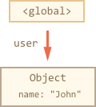
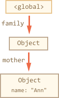
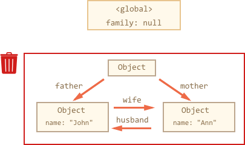

# Garbage collection

We create primitives, objects, functions... All that takes memory. 

What happens when something is not needed any more? How Javascript engine discovers that and cleans up? Memory management in Javascript is performed automatically and invisibly to us.
[cut]

## Reachability

The main concept of memory management in Javascript is *reachability*. 

Simply put, "reachable" values are those that are accessible or useable somehow. They are guaranteed to be stored in memory.

Formally, here's the definition.

1. There exists a base set of values that are considered reachable "by nature". 

    - Local variables and parameters of the current function.
    - Variables and parameters for other functions in the current chain of nested calls.
    - Global variables.
    - ...and few less common cases.

    These variables are called *roots*.

2. Any other value is considered reachable if it's reachable from a root by a reference of by a chain of references.

    For instance, if there's an object in a local variable, and that object has a property referencing another object, that object is considered reachable. And those that it references -- are also reachable. Detailed examples to follow.


There's a background process in the Javascript engine that is called [garbage collector](https://en.wikipedia.org/wiki/Garbage_collection_(computer_science)). It monitors all objects and removes those that became unreachable.

The process of such tracking is not that simple. Objects can be referenced from multiple variables. If two variables store a reference to the same object, then even if one of them is overwritten, the object is still accessible through the second one. That's why a special "garbage collector" is needed that watches the references.

The basic garbage collection algorithm is called "mark-and-sweep".

Regularly the following "garbage collection" steps are performed:

- The garbage collector takes roots and follows all references from them.
- It remembers all objects it meets and follows their references.
- ...And so on until there are unvisited references.
- After it, all objects that could not be visited, are considered unreachable and junked.

Let's see examples to get a better picture.

## A simple example

Here's the simplest example:

```js
// user has a reference to the object
let user = {
  name: "John"
};
```



The global variable `"user"` references John (the object `{name: "John"}`). Here and on further pictures, arrows depict references. The `"name"` property is not a reference, it stores a primitive, so it's painted inside the object.

If the `user` is overwritten, the reference is lost:

```js
user = null;
```


Now John becomes unreachable. There's no way to access it, no references to it. Garbage collector will junk the data and free the memory.

## Two references

Now let's imagine we copied the reference from `user` to `admin`:

```js
// user has a reference to the object
let user = {
  name: "John"
};

*!*
let admin = user;
*/!*
```


Now if we do the same:
```js 
user = null;
```

...Then the object is still reachable via `admin` global variable, so it's in memory. If we overwrite `admin` too, then it can be removed.


## Interlinked objects

Now a more complex example. The family:

```js
function marry(man, woman) {
  woman.husband = man;
  man.wife = woman;

  return {
    father: man,
    mother: woman
  }
}

let family = marry({
  name: "John"
}, {
  name: "Ann"
});
```

Function `marry` "marries" two objects by giving them references to each other and returns a new object that contains them both.

The resulting memory structure:


To activate garbage collection, let's remove two references:

```js
delete family.father;
delete family.mother.husband;
```

Note that if the deletion of any single one of them would not lead to anything, because all objects would still be reachable.

But if we delete both, then we can see that John has no incoming references any more:


**Outgoing references do not matter. Only incoming ones can make the object reachable.**

John, the former `family.father` is now unreachable and will be removed from the memory with all its data that also became unaccessible.

After garbage collection:



## Unreachable island

It is possible that the whole island of interlinked objects becomes unreachable and is removed from the memory.

The source object is the same as above. Then:

```js
family = null;
```

The result:



This example demonstrates how important the concept of reachability is.

It is clearly seen that John and Ann are still linked, both have incoming references. But it's not enough. 

The former `"family"` object has been unlinked from the root, there's no reference to it any more, so the whole island became unreachable and will be removed.

## Real-life algorithms

```smart header="Advanced knowledge"
The subsection contains advanced information about how things work internally. This knowledge is not required to continue learning Javascript.
```

The simple garbage collection algorithm that was described earlier in this chapter is not the best.

One of the main problems is that the collection process must be atomic: no new links should appear and no existing ones should be modified while it analyzes all references of existing objects and figures out which are unreachable. 

Essentially that means that the script execution must be paused to ensure that. Pauses may be small for simple scripts, but become noticeable (like 1000 ms or more) for big ones with many of objects. Such "hiccups" can be unpleasant and even disruptive for program systems that operate on real-time financial or medical data.

So many optimizations and variations of the algorithm exist.

One of most widely used optimizations in JS engines is called "generational" garbage collection.

- Objects are split into two sets: "old ones" and "new ones". Each set has its own memory area.
- A new object is created in the "new" memory area and, if survived long enough, migrates to the "old" one. 
- The "new" area is garbage collected often. The "old" area is rarely cleaned up.

In practice that helps a lot, because many small objects are created and destroyed almost immediately. For instance, local variables of a function usually become unreachable when it finishes. And those objects that keep the general program state, like an object with the current visitor data, may be big, but rarely require attention.

There are other optimizations and flavours of garbage collection algorithms. As much as I'd like to describe them here, I have to hold off, because different engines implement different tweaks and techniques. And they are subjects to change as engines develop. 

What's important is to know what garbage collection is and how it works in general. For ones that want to know more, there are books like "The Garbage Collection Handbook: The Art of Automatic Memory Management" (R. Jones at al).

If you are familiar with low-level programming, detailed information about V8 garbage collector is in the article [A tour of V8: Garbage Collection](http://jayconrod.com/posts/55/a-tour-of-v8-garbage-collection).


## Summary

- Objects are retained in memory while they are reachable.
- Being referenced is not the same as being reachable (from a root): a pack of interlinked objects can become unreachable as a whole.
- Modern engines implement advanced algorithms of garbage collector that try to evade stop-the-world problem of the old ones.
